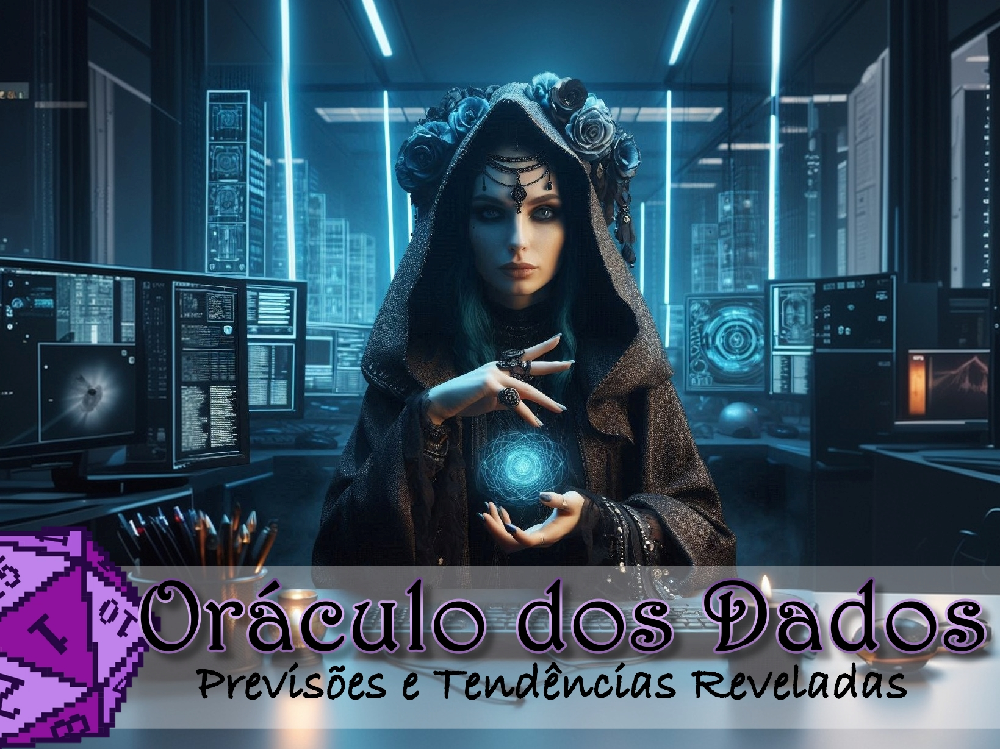

    preview do podcast

    <audio src="output/Oráculo dos Dados ep. 1.MP3" controls title="Podcast editado"></audio>

# Projeto Podcast Gerado por I.A.s

 > ℹ️ **NOTE:** Este é o repositório realizado para um bootcamp da [DIO](https://dio.me)

Projeto com o objetivo de gerar um podcast utilizando ferramentas de IA através de prompts mais trabalhado.

Utilizei uma esteira de prompts para gerar cada etapa do processo criativo.

## 📄 Prompts e ferramentas

ChatGPT：

|   Ação   | prompt                                                                                                                                                                                                                                                                         |
| :------: | ------------------------------------------------------------------------------------------------------------------------------------------------------------------------------------------------------------------------------------------------------------------------------ |
|  título  | Você é um roteirista de podcast e vamos criar um podcast de tecnologia feito por nerds focado na área de dados, e eu gostaria de uma ajuda sua para criar 5 sugestões de nomes criativos para um podcast de dados, gamer ou rpg, e que tenha algum trocadilho gamer ou de rpg no nome.O podcast vai falar sobre dicas e novidades sobre a área de dados e o que está acontecendo no mercado. O nome deve ser enxuto, deve ter algum trocadilho gamer ou de rpg, deve conter alguma palavra que remeta à área de dados, não quero que contenha palavras em inglês |
                                                                                                                                                                                    
| conteúdo | Você é um roteirista de podcast, e vamos criar um roteiro de um podcast de tecnologia, focado na área de dados cujo o nome é "Oráculo dos Dados – Previsões e Tendências Reveladas" e tem foco em dados, com o público alvo de iniciantes em análise de dados (e passei uma estrutura para o roteiro) |

Copilot：

|   Ação   | prompt                                                                                                                                                                                                                                                                         |
| :------: | ------------------------------------------------------------------------------------------------------------------------------------------------------------------------------------------------------------------------------------------------------------------------------ |
| conteúdo | uma apresentadora de um podcast tech, da área de dados, com ar inteligente, capa de um podcast, uma mulher, com ar de mistério, lembrando a um oráculo ou com roupas medievais, lembrando um rpg |

## 💻 Tecnologias utilizadas no projeto

- [ChatGPT](https://chat.openai.com/) 
- [Copilot](https://copilot.microsoft.com/)
- [ElevenLabs](https://beta.elevenlabs.io/)
- [Capcut](https://www.capcut.com/pt-br/)
- [Photoscape](http://www.photoscape.org/ps/main/index.php) 

## ✨ Como foi feito ?

- Roteiro gerado via chatgpt
- Audio gerado pela elevenLabs
- Copilot Para gerar a imagem de capa
- Capcut para tratar aúdio e adicionar sons de fundo
- Photoscape para editar a capa

